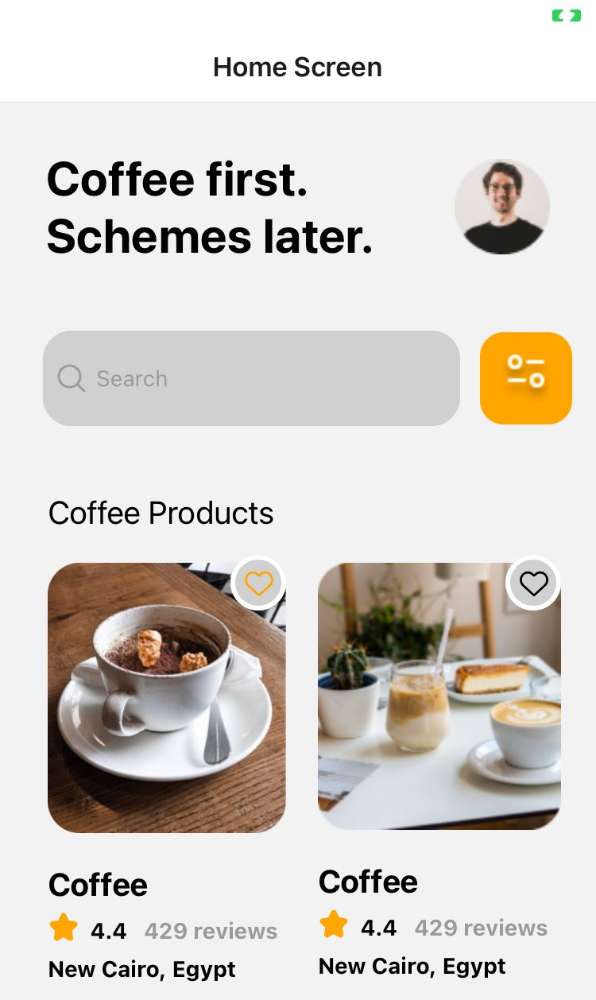
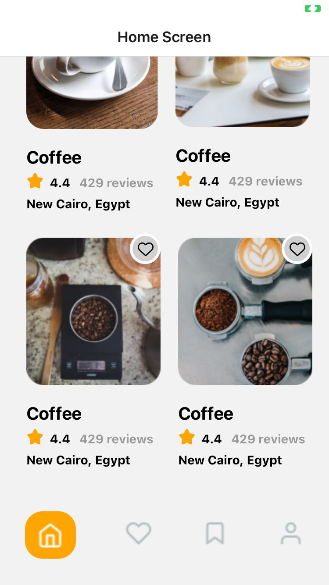
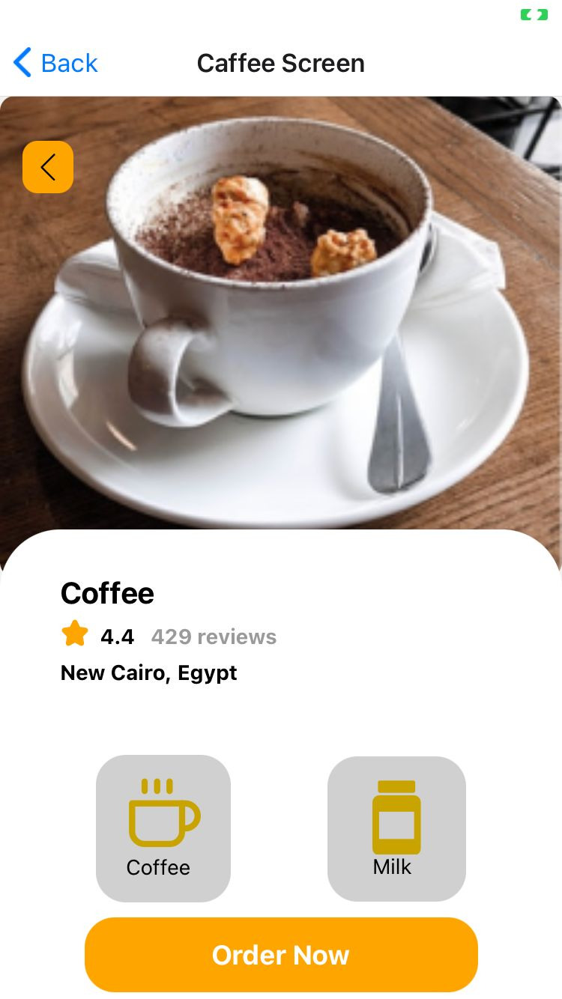

# Getting Started with Create React Native App

# this project uses react native 

## Available Scripts
In the project directory, you can install packages needed:
### `npm install`

In the project directory, you can run:
### `expo start` or `npm start`

Runs the app in the development mode.\
Open [http://localhost:19006](http://localhost:19006) to view it in your browser.

The page will reload when you make changes.\
You may also see any lint errors in the console.

## Screen Shots From Application ::

### - Home Screen :

### - Caffee Screen 

### - Record for whole Home Screen

### - You can navigate between Home and Caffee Screen by pressing on user icon in the bottom of home screen and click on back button in the left corner to go back to home again as shown here.

